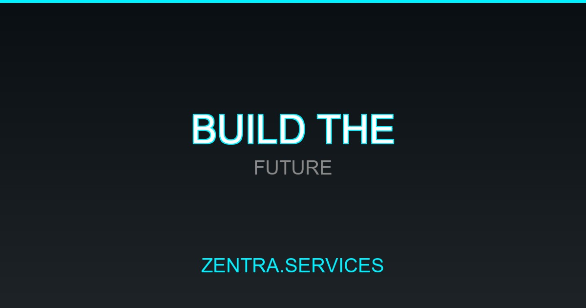

# 🛒 Zentra: High-Performance Static Affiliate Engine

> Advanced compiler-based static site generator (SSG) that compiles massive product feeds (140k+ entries) into 2,300+ paginated, ultra-fast, and SEO-optimized static category and product pages.

 *(OG Image placeholder)*

---

## 🔗 Links
*   **Tech Stack:** Node.js, Custom CSV Stream Parser, SQLite, Vanilla HTML5, CSS3, ES6+ Javascript, Python (asset optimization)

---

## 💡 Project Overview

### ❌ The Challenge
Database-backed affiliate and price-comparison portals are often sluggish, expensive to host, and vulnerable to security exploits at scale. Querying databases dynamically for thousands of items on every page visit slows load speeds, negatively impacting conversion rates and Google Core Web Vitals SEO rankings.

### 🛠️ The Solution
A **compiler-based static engine** that processes large CSV product feeds (such as Awin with over 140k items) offline, normalizes them, and builds a fully flat static HTML/CSS directory containing over 2,300 category and product pages. The live site is served purely as static files, resulting in sub-millisecond load times and zero database load.

### 🌟 Key Highlights
*   **⚡ Memory-Efficient Stream Parsing:** A custom streaming line-by-line parser reads massive 220MB+ CSV datafeeds in Node.js without exceeding memory constraints or crashing the engine.
*   **📈 Rich-Snippet Automation:** The compilation script injects structured JSON-LD microdata (valide Breadcrumbs, Product, FAQ, and CollectionPage schemas) into each page for Google Search listing prominence.
*   **🚀 100/100 Core Web Vitals:** Outputs code with DNS-prefetch tags, critical inline CSS, deferred script execution, and preloaded fonts to maximize loading speed.
*   **🔒 Complete Zero-DB Security:** Serving pure static files eliminates SQL injections, server-side code execution bugs, and database connection downtime completely.

---

## 🚀 Setup & Local Build

### Prerequisites
*   Node.js (v18+)

### Installation
1.  **Clone the repository:**
    ```bash
    git clone https://github.com/Salko-Agent/zentra-static-engine.git
    cd zentra-static-engine
    ```
2.  **Configure Firebase:**
    *   Add your client config keys into `firebase-config.js` (for wishlists/reviews support).
3.  **Prepare Product Feed:**
    *   A lightweight mock feed (`datafeed_2630106.csv`) is provided for testing.
    *   Replace this file with your actual CSV feed containing the standard Awin schema.
4.  **Run Build Script:**
    *   Compile the static site:
        ```bash
        node build.js
        ```
    *   The completed static site will be compiled into the `dist/` directory.
